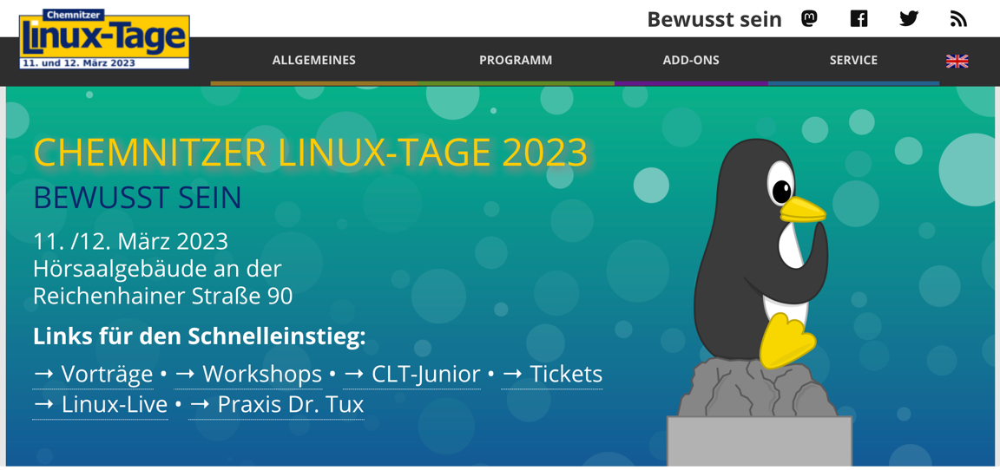
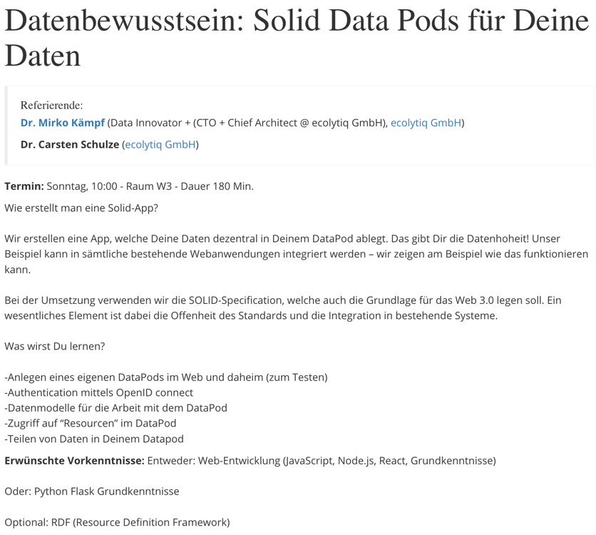
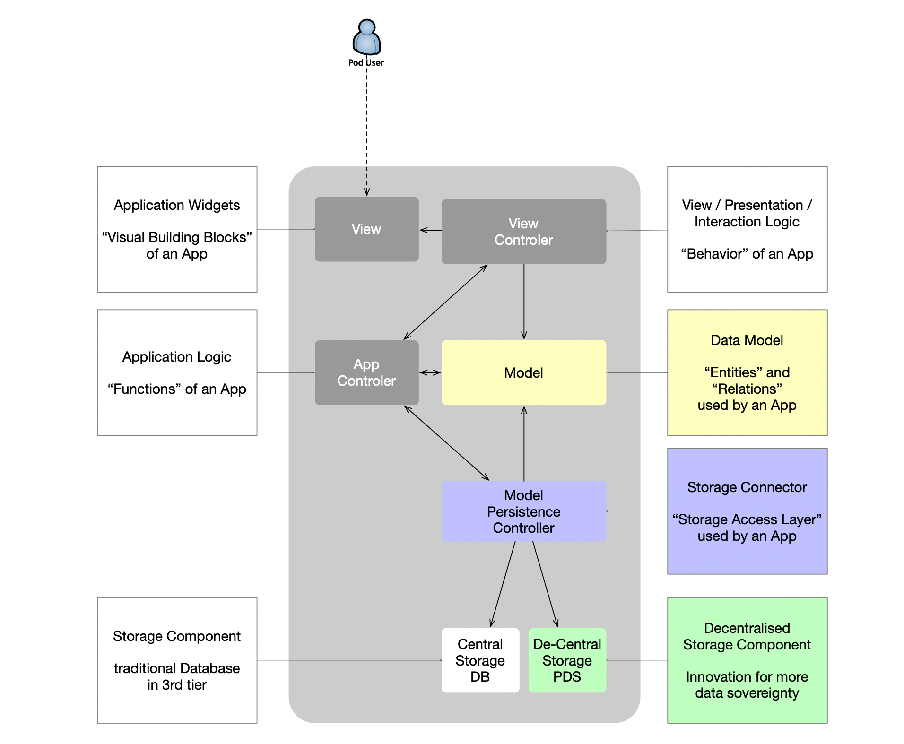

## Hands-on workshop about Solid Data Pods

The repository contains the material for our CLT2023 workshop around Solid Data Pods.

We will explore the anatomy of applications using Solid Data Pods.

This workshop has been prepared for the community event: __Chemnitzer Linux-Tage__.

# Overview 

This repository will be used for managing our open colaboration around the emerging topic: SOLID Data Pods. 
It is a private initiative supported by ecolytiq GmbH, OnfK gUG and the contributing developers.

This work uses the  __Apache License, Version 2.0__, January 2004 http://www.apache.org/licenses/.
 

## solid data pod provider

- solid community -- https://solidcommunity.net/

- inrupt -- https://start.inrupt.com/profile

- solidweb -- https://solidweb.org/

## List of Modules to explore Solid Pods

### Creation of a local pod
[Module 1](module-1/README.md)

### Working with solid-shell
[Module 2](module-2/README.md)

### Node.js based solid-client-app
This application stub uses the Inrupt JavaScript client libraries.

[Module 3](module-3/README.md)

### Python based solid-client-apps
[Module 4](module-4/README.md)

## SpringBoot application in Kotlin
[Module 5](module-5/README.md)

# Ideas for future extension

## How to dump a dataframe into a datapod?

## How to copy/move data from one pod to another?

## How to expose metadata in a pod, which becomes a "Meta-Pad"?
We can imagine, that indexed data can be exposed for other collaborators in a data pod. Many pods together could hold data which is then indexed in a central place for search, but what get added into the search corpus is controled by publishing documents into the pod. Deletion of a document leads to removal from the index. 

This means, that preindexing is done before publishing and all control regarding masking, anonymization and randomization is the publishers hand.

## Pod-Hosting using AWS, Azure, or fly.io

# Open Topics

## How to safeguard the Solid Pod?
## How to backup automatically?
## How to integrate in an hybrid personal storage cloud?

