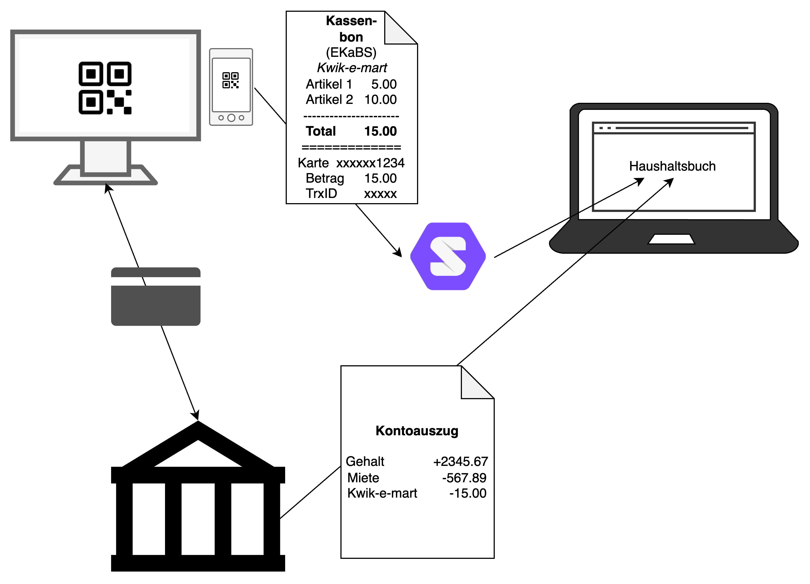

# Projektidee: Elektronische Kassenbelege im Data Pod

## Hintergrund
oderne Kassensysteme können als alternative zum Papierbon einen elektronischen Kassenbeleg erzeugen. 
Dieser wird üblicherweise als Download bereitgestellt; der Download-Link wird als QR-Code auf dem Kundendisplay angezeigt.

Im April 2021 hat der Deutsche Fachverband für Kassen- und Abrechnungstechnik den ["Elektronischen Kassenbeleg-Standard"](https://dfka.net/ekabs) in Version 1.0.0 veröffentlicht.

Der Kassenbeleg wird als PDF mit eingebettetem JSON Object bereitgestellt.

## Die Idee
Elektronische Kassenbelege werden in einen (privaten) Solid-Pod eingelesen. Auf diesen Pod hat auch das elektronische Haushaltsbuch Zugriff. Die Ausgaben können zentral (z.B. für die ganze Familie) erfasst werden, ohne dass Papierbelege gesammelt werden müssen.

Im Weiteren könnte die Haushaltsbuch-Anwendung mit den Kontoauszügen der Bank "gefüttert" werden, um Kartenzahlungen den Ausgaben zuzuordnen.

## Resourcen
* [EKaBS]((https://dfka.net/ekabs))
  * [Beschreibung deutsch (lokal)](EKaBS-Elektronischer-Kassen-Beleg-Standard_1.0.0_Stand_14.04.2021.pdf)
  * [Beschreibung englisch (lokal)](EKaBS-electronic-cash-register-receipt-standard-1.0.0-as-of-14.04.2021.pdf)
  * [JSON Schema](ekabs-schema.json)
* [Beispiel JSON](ekabs-example.json)